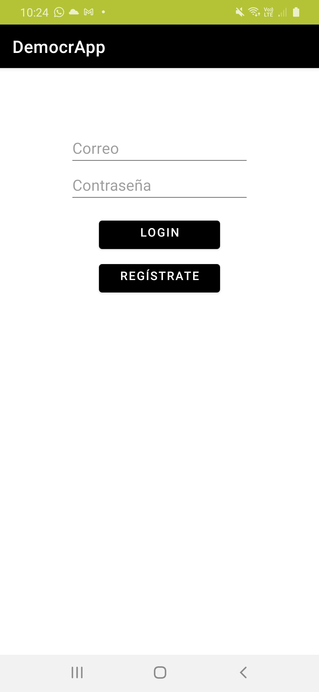
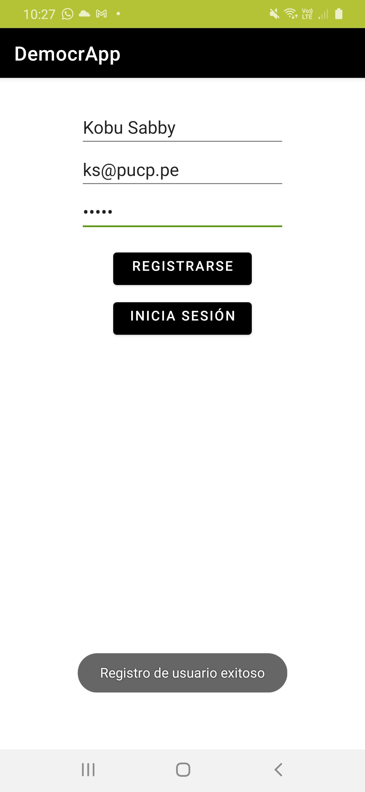
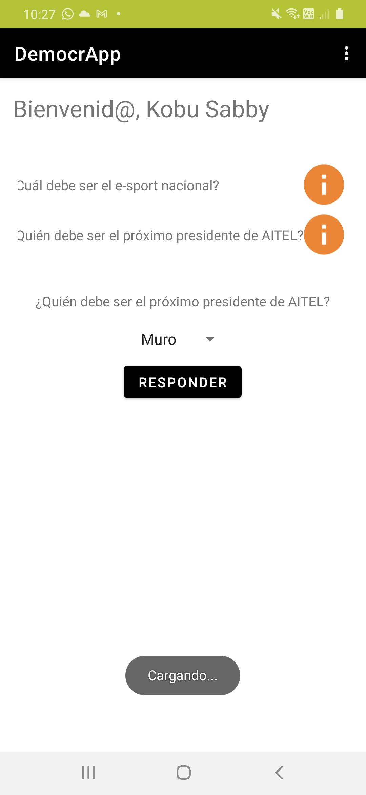
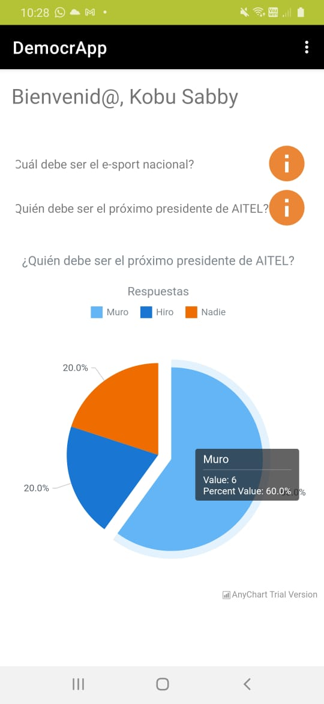

# DemocrApp
_Due to the recent political events in the country of United Departments of South America (DDUU), the government has selected a group of students from the Pontificia Universidad Catolica del Peru from the TEL306 class to develop an app that contributes to the preservation of democracy. With this application, the citizens will be asked various questions so that the decision that are made, they are according to popular consensus._

## API REST :cloud:
_The country has enabled Web Services which guarantee the citizens' information security. All questions are provided by this country's government_

## Let's start! 📌
* All users can register themselves, but only the users that are properly **logged in** can see the questions. On the registration form, the username must have exactly two words, each one starting with uppercase.
* The government throught its API will provide different questions which the users will be able to answer.
* After login, click the  <span></span>  button next to the question you want to answer/view. **You can only answer each question once.**

  1. If you **have not answered** the selected question, you can answer the question choosing from the available list and pressing the "Responder" button.
  2. If you **have answered** the selected question, you will immediately see a chart with the **statistics** of each available answer for that question.

## Operation ⚙️
To clone the repository:
```
gir clone https://github.com/allisonvp/Lab4G4.git
```
## Screenshots :camera:
<table>
    <tr>
        <td width="25%">
            <h3 align="center">Login</h3>
            <hr>          
            
            <sup>
              <a>Login example.</a>
            </sup>            
        </td>
        <td width="25%">
            <h3 align="center">Register</h3>
            <hr>          
            
            <sup>
              <a>Register example.</a>
            </sup>            
        </td>
        <td width="25%">
            <h3 align="center">Answer the Question</h3>
            <hr>          
            
            <sup>
              <a>Answer View Example.</a>
            </sup>            
        </td>
        <td width="25%">
            <h3 align="center">Question Statistics</h3>
            <hr>          
            
            <sup>
              <a>Statistics Example.</a>
            </sup>            
        </td>
    </tr>
</table>  

## More information 📖
_You can find more information about how we made the charts in [AnyChart for Android](https://github.com/AnyChart/AnyChart-Android)_

## Authors ✒️
* **Katherine Vargas** - *Author* - 20160555
* **Allison Velarde** - *Author* - 20160618
* **Alonso Guevara** - *Author* - 20160679

## To Do :pencil:
* Fix the list of question view :eyes:.

## License :green_book:

- Copyright 2020 © **Bizcochitos**
- Project from **Mobile Application Development**
